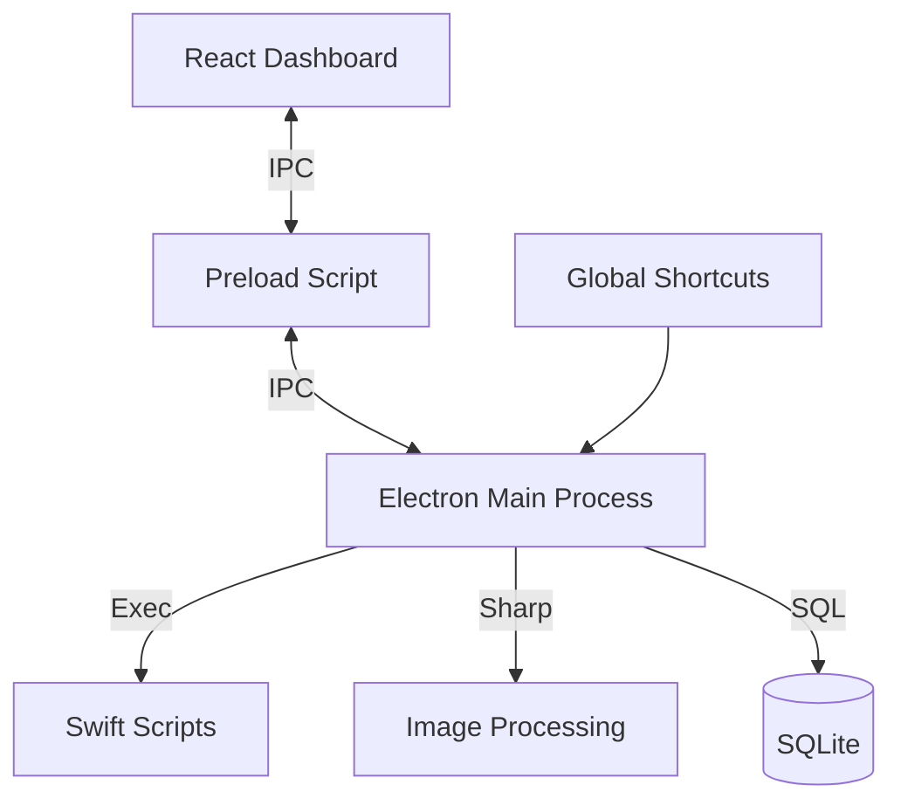

# System Design - SnapFlow (Scope)

## Overview

SnapFlow (Scope) is a high-performance screen capture tool for macOS, designed to eliminate overlay lag and capture fleeting desktop states (like dropdown menus). It features three core modes: Region, Window, and Scroll Capture.

## Architecture

The application follows a standard Electron multi-process architecture:

- **Main Process**: Handles global shortcuts, native window detection (via Swift), image processing (via Sharp), and local database management (via Better-SQLite3).
- **Renderer Process**: A React-based UI that provides the Dashboard and the "Live Overlay" for selection.
- **Native Integration**: Custom Swift scripts are used for precise window detection and keycode simulation (for scrolling).

### 1. Zero-Latency Overlay

Traditional capture tools often pause the screen or steal focus when an overlay is launched. Scope uses a transparent, non-focus-stealing `BrowserWindow` that acts as a "drawing canvas" over the entire screen. This allows users to capture menus that would otherwise close upon a focus change.

### 2. Smart Scroll Capture

Scroll capture is implemented using a feedback loop:

1.  **Region Selection**: User selects the scrollable area.
2.  **Capture Loop**:
    - Take a screenshot of the region.
    - Simulate a scroll down event (Arrow Down).
    - Wait for content stabilization.
    - Check for duplicate frames (exit condition).
3.  **Smart Stitching**:
    - **Block Matching**: Compares the bottom of the previous frame with the top/middle of the current frame to find the exact overlap.
    - **Inertia**: Uses the previous scroll distance to narrow the search range for the next overlap, improving performance and accuracy.
    - **Sticky Header Detection**: Automatically identifies and crops fixed-position headers to ensure they don't appear multiple times in the long screenshot.

### 3. Native Bridge (Swift)

- `get-windows.swift`: Uses `CGWindowListCopyWindowInfo` to get accurate bounds of all visible windows.
- `click.swift` / `keypress.swift`: Uses `CGEventPost` to simulate user interactions without requiring accessibility permissions for the whole app in most cases.

## Data Flow

## Security & Privacy

- **Local-By-Design**: All captures and database records are stored locally on the user's machine.
- **Permissions**: Requires "Screen Recording" and "Accessibility" (for interaction simulation) permissions on macOS.
